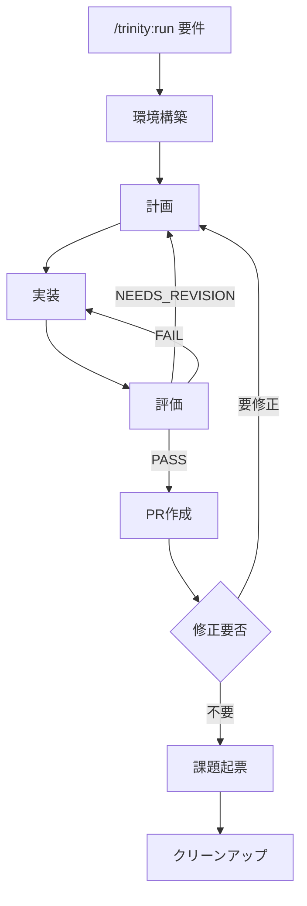

# Trinity — Claude Code 用の3エージェント・ハーネス

Trinity は、Anthropic の Planner / Generator / Evaluator パターンを Claude Code のサブエージェントで実装した、長時間タスク向けのハーネスである。 `/trinity:run <要件>` で起動すると、 `git-flow` スキルが切り出した隔離 git worktree の中で Generator が実装してコミットし、Evaluator が Production-Ready の品質水準を承認するまで反復する。承認後はオーケストレーターが Pull Request を作成し、修正要否・課題起票・クリーンアップを `AskUserQuestion` でユーザーに確認しながら統合まで進める。

## 目次

- [構成](#構成)
- [処理フロー](#処理フロー)
- [3エージェントに分ける理由](#3エージェントに分ける理由)
- [ディレクトリ構成](#ディレクトリ構成)
- [作業領域の隔離](#作業領域の隔離)
- [エージェント間の通信契約](#エージェント間の通信契約)
- [モデル割り当て](#モデル割り当て)
- [使い方](#使い方)
- [評価](#評価)
- [設定](#設定)
- [拡張と縮退の指針](#拡張と縮退の指針)
- [参考資料](#参考資料)

## 構成

ハーネスは、リポジトリにコミットする設定ファイル群と、ランタイムで動くアクター群で構成される。worktree の切り出し・Pull Request・後片付けといった git 運用は Trinity 固有ではないため、外部の `git-flow` スキルに委譲する。

設定ファイルの役割を以下に示す。

| 種別 | ファイル | 役割 |
| --- | --- | --- |
| プラグイン宣言 | `.claude-plugin/plugin.json` | 名前・バージョン・作者の宣言 |
| オーケストレーター | `commands/run.md` | `/trinity:run` の手順とループ規範 |
| Planner | `agents/planner.md` | 要件を受け入れ基準付きの `plan.md` に展開する |
| Generator | `agents/generator.md` | チャンクを `worktree` 内で実装してコミットする |
| Evaluator | `agents/evaluator.md` | コミットを評価して `eval-<n>.md` と判定を出す |
| 権限 | `settings.json` | スキーマ宣言のみ。事前承認リストは持たない |

ランタイムで動くアクターの責務を以下に示す。

| アクター | 実体 | 責務 |
| --- | --- | --- |
| Orchestrator | Claude（メイン会話） | 環境構築、各段の直列起動、PR 作成、確認、クリーンアップ |
| Planner | サブエージェント（opus） | 要件を `plan.md` に展開し、コミット単位のチャンクへ分割する |
| Generator | サブエージェント（sonnet） | 割り当てチャンクを worktree 内で実装し、検証を通して1コミットする |
| Evaluator | サブエージェント（sonnet） | コミットを `plan.md` の基準で独立評価し、判定を書く |

Orchestrator は段と段のあいだでコードを自分で読んだり編集したりしない。受け渡しは `RUN_DIR` `WORKTREE_DIR` `BRANCH` のパスとコミット SHA だけにする。各エージェントが成果物ファイルから動くという原則がハーネスの本質である。

## 処理フロー

`/trinity:run` は環境構築から統合までを直列に進める。イテレーション内では Planner・Generator・Evaluator を同期的に呼び、Evaluator の判定でループの継続と離脱を決める。



各段階の担い手と内容を以下に示す。

| 段階 | 担い手 | 内容 |
| --- | --- | --- |
| 環境構築 | Orchestrator + `git-flow` | `RUN_DIR` と worktree を用意する。既存の作業環境があれば再利用する |
| 計画 | Planner | 要件を `plan.md` に展開し、コミット単位のチャンク `M` に分割する |
| 実装 | Generator | チャンクごとに起動し、検証チェーンを通して1チャンク = 1コミットする |
| 評価 | Evaluator | 最終コミット SHA と `plan.md` から `eval-<n>.md` と判定を出す |
| 判定分岐 | Orchestrator | `PASS` で離脱、 `NEEDS_REVISION` / `FAIL` は続行する |
| PR作成 | Orchestrator + `git-flow` | `PASS` 後に push して PR を作成する。既存 PR があれば追加 push する |
| 修正判断 | Orchestrator | PR の URL を共有し、 `AskUserQuestion` で修正要否を確認する |
| 課題起票 | Orchestrator | 対象リポジトリと Trinity の改善課題を `AskUserQuestion` で提案・起票する |
| クリーンアップ | Orchestrator + `git-flow` | 明示承認後に worktree・ブランチ・`RUN_DIR` を削除する |

判定分岐の挙動は Evaluator の3値判定に従う。 `PASS` はループを離脱して PR 作成へ進む。 `NEEDS_REVISION` は Planner が次周回で `plan.md` を上書きして再計画する。 `FAIL` は Generator が修正作業を実施する。 `NEEDS_REVISION` と `FAIL` はいずれも続行扱いで、Generator が検証失敗を自力で直せない場合はコミットを作らずに停止して報告する。

修正判断で「要修正」となった場合は、実装段階へ戻って同じループを再開する。「不要」となった場合のみ課題起票とクリーンアップへ進む。

## 3エージェントに分ける理由

1つのエージェントで計画・実装・評価をまとめてやると、コンテキストが膨らむほどドリフトが起きる。実装の途中で計画が書き換わり、評価者が自分の作品を甘く見て、探索のトークンが実装のトークンを圧迫する。役割を3つのサブエージェントに分け、それぞれに固有のシステムプロンプトと新鮮なコンテキストを与えることで、各段の集中を保ち、評価者の独立した懐疑性を担保する。

Evaluator の独立性は、ファイルベースの通信によって構造的に強制される。Evaluator は `plan.md` と git diff を読み、Generator のチャットコンテキストや内部推論は読まない。差分は自分で再導出し、検証チェーンも自分で再実行する。これによって「自分の書いたコードに甘くなる」という単一エージェントの典型的な失敗モードが、設計上発生し得なくなる。

## ディレクトリ構成

エージェント定義とコマンドは `trinity/` プラグイン内に、ランタイム成果物は実行プロジェクトの `.trinity/` 以下に置く。前者はリポジトリにコミットし、後者は `.gitignore` で除外する。

プラグインの構成を以下に示す。

```shell
trinity/
├── .claude-plugin/
│   └── plugin.json     # プラグイン宣言（name, version, author）
├── agents/
│   ├── planner.md      # opus   · 要件 → plan.md
│   ├── generator.md    # sonnet · plan.md → worktree 内のコード＋コミット
│   └── evaluator.md    # sonnet · コミット → eval-<n>.md・判定
├── commands/
│   └── run.md          # /trinity:run オーケストレーター（手順・ループ規範）
├── settings.json       # スキーマ宣言のみ
└── README.md           # 本ファイル
```

ランタイム成果物は実行プロジェクト直下の `.trinity/<run>/` に集約する。各 run は独立したディレクトリを持ち、計画・各チャンクの実施レポート・評価レポート・worktree を収める。

```shell
.trinity/
└── 20260429T153000Z-add-theme-toggle/      # run ディレクトリ
    ├── plan.md                             # Planner 出力（イテレーション間で上書き）
    ├── gen-1-chunk-1.md                    # Generator のチャンク実施レポート
    ├── eval-1.md                           # Evaluator 出力（イテレーション 1）
    ├── eval-2.md                           # 〃 （イテレーション 2）
    └── worktree/                           # git-flow が切り出した隔離 worktree
```

途中で止まった run を再開する場合は、既存の `RUN_DIR` 内の成果物がそのまま再利用される。 `plan.md` があれば Planner をスキップして Generator から、 `eval-<n>.md` があればその判定に応じて続きのイテレーションから再開する。完了済みの最新イテレーションの次から続ける。

## 作業領域の隔離

`git-flow` は `git-flow` の命名規則に従う作業ブランチを、別ディレクトリの worktree として切り出す。Generator はその中だけで読み書きとコミットを行い、ユーザーが現在チェックアウトしているブランチには一切手を触れない。

通常は `origin/main`（デフォルトブランチ）の最新を base としてブランチを派生させる。ユーザーが現在いるブランチには依存しない。既存ブランチや open PR を継続する場合は、その PR の head ブランチを worktree にチェックアウトして続ける。

この隔離がもたらす性質を以下に示す。

- ユーザーの本来のチェックアウトは一切汚れない。Trinity 実行中も別の作業を続けられる。
- 複数の `/trinity:run` を並行で動かしてもお互いに踏み合わない。各 run は独立した worktree を持つ。
- worktree の後始末はユーザーの承認次第で行う。マージ後に明示承認を受けた場合のみ、 `git-flow` に従って worktree とブランチを片付け、 `RUN_DIR` を削除する。

## エージェント間の通信契約

サブエージェントは互いのチャットコンテキストを見ない。ファイルを介して受け渡しを行う。Orchestrator は絶対パスだけを各段に渡す。

| 出力者 | ファイル / 成果物 | 読む側 |
| --- | --- | --- |
| Planner | `${RUN_DIR}/plan.md` | Generator、Evaluator |
| Generator | `${WORKTREE_DIR}` 内の1コミット（SHA）と `${RUN_DIR}/gen-<n>-chunk-<i>.md` | Evaluator |
| Evaluator | `${RUN_DIR}/eval-<n>.md` | Planner（次イテレーション）、Orchestrator（最終化時） |

引用ルールはハーネス全体で一貫させる。 `plan.md` `eval-<n>.md` の中で示す `path:line` は `WORKTREE_DIR` 起点の相対パスで書く。Generator/Evaluator は同じ worktree を起点に読むためズレない。PR 本文に貼ったときもレビュアーがリポジトリ相対で読める。

## モデル割り当て

軸となる配分を以下に示す。各エージェントの frontmatter にある `model:` で個別に上書きできる。

| エージェント | モデル | 理由 |
| --- | --- | --- |
| Planner | opus | 漠然とした意図を二値の受け入れ基準に落とす、最も推論負荷の高い段 |
| Generator | sonnet | 仕様が明確な大量作業向き。コスト効率が良い |
| Evaluator | sonnet | 独立した懐疑性は Opus を要さない。Sonnet で十分かつ低コスト |

## 使い方

代表的な呼び出しを以下に示す。

```shell
/trinity:run ユーザー設定ページにテーマトグルを追加する。
/trinity:run 認証モジュールを JWT からセッションCookie に移行する。
```

`/trinity:run` を起動した時点で、ユーザーはパイプライン全体（worktree 作成、ブランチ push、PR 作成または既存 PR への追加 push）への明示的な許可を出したものとして扱う。PR 確定まではユーザー確認を取らずに進める。PR 確定後は `AskUserQuestion` で修正要否・課題起票・クリーンアップを都度確認する。

起動時のリポジトリ状態によって、新規ブランチで始めるか既存 PR を継続するかが決まる。デフォルトブランチ上にいれば新規ブランチを切り、open PR に対応するブランチ上にいればその PR を継続して追加 push のみを行う。新規に始めたい場合はデフォルトブランチに戻ってから実行する。

API 課金エラーやレートリミットで途中停止した場合は、対応する作業環境が残っていれば再実行で続きから再開する。新しい worktree は作られず、完了済みの最新イテレーションの次から続行する。

## 評価

Evaluator は独立した懐疑的判定者として、Generator のコミットを `plan.md` の受け入れ基準に照らして妥協なく評価する。証拠は自分で再導出し、検証チェーン（型・Lint・ユニット・必要なら UI スモーク）を `WORKTREE_DIR` 内で再実行する。Generator の PASS 主張をそのまま信じない。

判定は項目ごとに二値で出す。「だいたい」「部分的」は採用せず、各軸が Production-Ready の品質水準を上回ることを必要条件とする。すべての指摘には `path:line` の出典を添える。一度出した指摘を黙って取り下げることは禁止する。新しい証拠で「修正済み」を確認するか、未解決として持ち越すかのどちらかである。

最終的な判定は3値で出る。

| 判定 | 動作 |
| --- | --- |
| `PASS` | ループを離脱して PR 作成へ進む |
| `NEEDS_REVISION` | 続行。Planner が次周回で `plan.md` を上書きして再計画する |
| `FAIL` | 続行。Generator が修正作業を実施する |

## 設定

Trinity は固有の事前承認リストを持たない。 `settings.json` はスキーマ宣言だけを置き、ツールの許可は親リポジトリ（`~/.claude/` など）のユーザー設定に委ねる。worktree 操作・push・PR 作成・クリーンアップといった `git-flow` 由来のコマンドは、承認済みでなければ実行時にプロンプトが出る。破壊的なコマンドや珍しいコマンドが明示的な承認を要するのは意図的である。

UI スモークに使う Playwright MCP は、必要に応じて別途設定する。

## 拡張と縮退の指針

ハーネスの各部品は「モデル単独でできないこと」についての仮定を表している。モデルが進化するにつれて不要になった部品は積極的に削るべきである。

縮退のシグナルを以下に示す。

- Planner の計画が連続して無修正で通り、Generator からの確認も発生しない。小タスクでは Planner を抜き、Generator が直接ユーザー要件から動かす。
- Evaluator がイテレーション1で高頻度に PASS を返す。評価軸が緩いか、Evaluator のコストが見合わない。
- イテレーションを重ねても判定が変わらない。ループの上限や評価の粒度を見直す。

4つ目のエージェント（Planner の前に Researcher、Evaluator の後に Refiner）を足すのは、欠けている能力がボトルネックだと示す証拠が手に入ってからにする。先回りで足すべきものではない。

## 参考資料

- Anthropic「Harness design for long-running apps」 https://www.anthropic.com/engineering/harness-design-long-running-apps
- Qiita「@nogataka 氏の解説記事」 https://qiita.com/nogataka/items/efe8eb9df612d2211221
