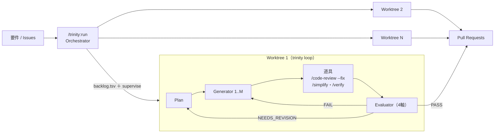

# Trinity

Trinity は、Anthropic の Planner / Generator / Evaluator パターンを Claude Code のサブエージェントで実装した、長時間タスク向けのハーネスである。 `/trinity:run <要件>` で起動すると、 `git-flow` スキルが切り出した隔離 worktree の中で Generator が実装してコミットし、Evaluator が Production-Ready の品質水準を承認するまで反復する。承認後はオーケストレーターが Pull Request を作成し、修正要否・課題起票・クリーンアップをユーザーに確認しながら統合まで進める。

小さい具体的タスクから大きな抽象的タスクまで、あらゆるエンジニアリングタスクを同じひとつの仕組みに落とす。ユーザーが負うのはバックログの管理と、成果を受け入れるかの判断だけになる。フォアグラウンドの Orchestrator は自由形式の要件解釈とユーザー対話に専念し、Issue ごとの収束ループ（`Plan → Generator → 道具 → Evaluator`）はシェルへ機械化して背景で回す。機械が下せる8割——実行検証・差分レビュー・整理——は組み込みコマンド `/verify`・`/run`・`/code-review --fix`・`/simplify` を Evaluator の道具として委ね、Evaluator は削れない2割の判断にだけ希少な判断力を注ぐ。

## 役割の分離と独立性

計画・実装・評価を1つのコンテキストに同居させると、文脈が膨らむほどドリフトが起きる。実装の途中で計画が書き換わり、評価者が自分の作品を甘く見て、探索のトークンが実装のトークンを圧迫する。Trinity は役割を3つのサブエージェントに分け、それぞれに固有のシステムプロンプトと新鮮なコンテキストを与える。これにより各段の集中と、評価者の独立した懐疑性を保つ。

Evaluator の独立性は、ファイルベースの通信によって構造的に強制される。Evaluator は `plan.md` と git diff だけを読み、Generator のチャットコンテキストや内部推論は読まない。差分は自分で再導出し、検証チェーンも自分で再実行する。これにより「自分の書いたコードに甘くなる」という単一エージェントの典型的な失敗モードが、設計上発生し得なくなる。パイプラインは各アクターを headless な `claude -p` の別プロセスとして起動するため、この間接化はプロセス境界として強制される。

## 機械に委ねない4軸

組み込みの `/code-review` は差分のバグと整理を自動で見るが、「要件を満たせているか」「デザインは美しいか」「コードは美しいか」「そもそも要件が正しいか」という総合判断はしない。この4軸は機械に委ねられない判断であり、Evaluator がこれを担う。組み込みコマンドは Evaluator の置換ではなく、その**道具**である。機械が下せる8割を道具が前段で片付け、Evaluator は次の4軸の判断にだけ希少な判断力を注ぐ。

| 軸 | 問い |
| :-- | :-- |
| 要件適合 | 受け入れ基準を実装が満たしているか |
| デザインの美 | UI・API・データモデルが素直で一貫しているか |
| コードの美 | 命名・構造・抽象が周囲に馴染み読み手に易しいか |
| 要件妥当性 | そもそもの要件・計画が正しいか |

## 構成

オーケストレーターとサブエージェント3者で構成される。Orchestrator はメイン会話の Claude で、コードには触れず各段の起動と統合フローだけを担う。各アクターの役割を以下に示す。

| アクター | モデル | 役割 |
| :-- | :-- | :-- |
| Orchestrator | メイン会話 | 要件解釈・ユーザー対話・環境構築・背景パイプラインの dispatch と監視・PR 作成・確認・クリーンアップ |
| Planner | opus | 要件を受け入れ基準付きの `plan.md` と機械可読な `tasks.tsv` に展開する（Issue ごと） |
| Generator | sonnet | 割り当てタスクを worktree 内で実装し、検証を通して1コミットする |
| Evaluator | sonnet | コミットを4軸で独立・読み取り専用に評価し、3値判定を書く |

内側ループの制御フローはシェルへ機械化する。Orchestrator は内側ループを駆動せず、背景パイプラインへ dispatch して監視に徹する。

| 機構 | 実体 | 役割 |
| :-- | :-- | :-- |
| `bin/trinity loop` | シェル（サブコマンド） | 1 Issue の `Plan → Generator → 道具 → Evaluator` 収束ループ。背景で走る |
| `bin/trinity supervise` | シェル（サブコマンド） | `backlog.tsv` を読み、起動可能な Issue を背景起動し、手当てが要るイベントまでブロックして待つ |
| `lib/actors.sh` | シェル | 各アクターを `claude -p` の子プロセスとして起動するステートレスな呼び出し層 |

agent 定義は `agents/` に、ハーネスは `bin/trinity`（単一の実行ファイル）と `lib/actors.sh` に、Orchestrator の手順は `commands/run.md` に置く。アクターの振る舞いの単一の正は `agents/<role>.md` であり、`lib/actors.sh` はその本文を指示として注入する。ランの成果物（`plan.md`・`tasks.tsv`・`eval-*.md`・`gen-*.md`・`review-*.md`・`status`・`trinity.log` 等）は対象プロジェクトの `.trinity/<session>/<slug>/` に出力され、`backlog.tsv` は `.trinity/<session>/` に置かれる。worktree は `git-flow` スキルが `.trinity/` の外に切り出す。Pull Request・後片付けといった git 運用も同様に `git-flow` スキルに委譲する。

## Processing Units

Trinity が計画・実装を扱う処理単位を、粒度の大きい順に定義する。

| 用語 | 定義 |
| :-- | :-- |
| セッション | `/trinity:run` の起動から、PR 作成・改善提案（課題起票）・クリーンアップまでの、コマンド1回の実行全体。複数のパイプラインを束ねる最上位の単位 |
| パイプライン | 1つの Worktree で実行される処理系列。ループを Production-Ready な品質水準に達するまで繰り返し、1つの PR を作成するまでの流れ |
| ループ | パイプライン内で繰り返される `Plan → Generator → 道具 → Evaluator` の1周。道具（`/code-review --fix`・`/simplify`・`/verify`）で機械的な8割を片付けた上で、Evaluator の3値判定が継続と離脱を決める |
| タスク | 各 Generator が実施する1コミット単位の実行・動作。独立して動作し単独で検証可能な最小実装単位 |

## 処理フロー

要件を受け取った Orchestrator は、Issue 群を `backlog.tsv` に落とし、`trinity supervise` で Issue ごとのパイプラインを背景起動する。各パイプライン（`trinity loop`）の内部では Planner・Generator・Evaluator が `claude -p` の別プロセスとして連携し、道具で機械的な8割を片付けた上で、Evaluator の3値判定がループの継続と離脱を決める。図は処理の全体像を抽象的に示す。



判定ごとの動作を以下に示す。ループの離脱は Evaluator の `PASS` だけで決まる（道具が機械的な指摘を前段で自動修正済みのため）。

| 判定 | 動作 |
| :-- | :-- |
| `PASS` | 4軸すべてを満たす。ループを離脱して PR 作成へ進む |
| `NEEDS_REVISION` | 計画・要件が誤り。Planner が再計画する。要件自体が疑わしければ Planner が `## 要確認の論点` でユーザーに差し戻す |
| `FAIL` | 既存計画の範囲内で Generator が修正する |

`PASS` に達するとパイプラインの `status` が `passed` になり、Orchestrator が push して PR を作成し、 `AskUserQuestion` で修正要否・課題起票・クリーンアップを順に確認する。計画中に設計分岐が見つかった場合、Planner は `## 要確認の論点` を surface し、パイプラインは確認待ち（`needs-input`）でブロックする。`AskUserQuestion` を呼ぶのは常にフォアグラウンドの Orchestrator だけで、回答はファイルチャネル（`ask/q`・`ask/a`）で背景パイプラインへ橋渡しされる。

## 前提条件

Trinity を動かすには、以下のスキル／コマンドを事前にインストールする。ハーネスのシェルスクリプト（`bin/`）は実行可能ビットが立っている前提で、`bash` と `git`、`claude` CLI が PATH にあること。

- [git-flow スキル](https://github.com/yjn279/.claude/tree/main/skills/git-flow) — worktree の作成・ブランチ管理・PR 統合を担うスキル。Orchestrator はこのスキルに git 運用を委譲する。
- [code-review コマンド](https://github.com/anthropics/claude-code/tree/main/plugins/code-review) — `/code-review --fix` を Evaluator の道具として、差分のバグと整理を自動修正するために使う。
- `/simplify`・`/verify`・`/run` — それぞれ整理の適用、挙動の検証、アプリの起動を担う Evaluator の道具。Claude Code の組み込みコマンド。

現状のターゲットは Claude（`claude -p`）。各アクターの呼び出しは `lib/actors.sh` に閉じており、別エージェント CLI へ寄せる場合の差し替え境界もここになる。

## 使い方

代表的な呼び出しを以下に示す。

```shell
/trinity:run ユーザー設定ページにテーマトグルを追加する。
/trinity:run 認証モジュールを JWT からセッション Cookie に移行する。
```

複数 Issue を同時に指定できる。互いに影響しない変更は Issue ごとに環境を整備して並列に処理し、それぞれ独立した PR を生む。影響する変更は依存する変更の実装後に後続を直列で実装する。いずれの場合も各 Issue は独立した PR として残し、統合（マージ）はしない。

```shell
/trinity:run #12 #15 #20
```

`/trinity:run` を起動した時点で、worktree 作成・ブランチ push・PR 作成までの許可を出したものとして扱う。PR 確定後は `AskUserQuestion` で修正要否・課題起票・クリーンアップを都度確認する。API 課金エラーやレートリミットで途中停止した場合は、作業環境と `.trinity/<session>/` が残っていれば、未起動の Issue は `trinity supervise` の再実行で起動し、各 Issue の `status` から到達点を判定して続きから再開する。

## リリース運用

詳細は [`docs/release.md`](docs/release.md) を参照する。

## 参考資料

- Anthropic「Harness design for long-running apps」 https://www.anthropic.com/engineering/harness-design-long-running-apps
- Qiita「@nogataka 氏の解説記事」 https://qiita.com/nogataka/items/efe8eb9df612d2211221
