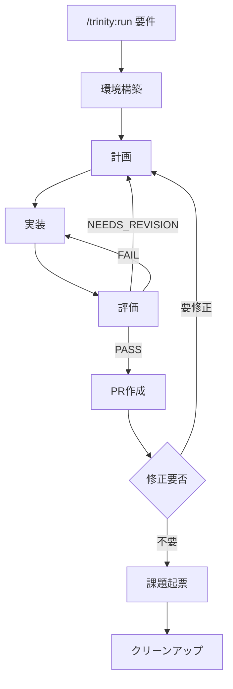

# Trinity

Trinity は、Anthropic の Planner / Generator / Evaluator パターンを Claude Code のサブエージェントで実装した、長時間タスク向けのハーネスである。 `/trinity:run <要件>` で起動すると、 `git-flow` スキルが切り出した隔離 worktree の中で Generator が実装してコミットし、Evaluator が Production-Ready の品質水準を承認するまで反復する。承認後はオーケストレーターが Pull Request を作成し、修正要否・課題起票・クリーンアップをユーザーに確認しながら統合まで進める。

## なぜ3エージェントに分けるのか

1つのエージェントで計画・実装・評価をまとめてやると、コンテキストが膨らむほどドリフトが起きる。実装の途中で計画が書き換わり、評価者が自分の作品を甘く見て、探索のトークンが実装のトークンを圧迫する。役割を3つのサブエージェントに分け、それぞれに固有のシステムプロンプトと新鮮なコンテキストを与えることで、各段の集中と評価者の独立した懐疑性を保つ。

Evaluator の独立性は、ファイルベースの通信によって構造的に強制される。Evaluator は `plan.md` と git diff だけを読み、Generator のチャットコンテキストや内部推論は読まない。差分は自分で再導出し、検証チェーンも自分で再実行する。これにより「自分の書いたコードに甘くなる」という単一エージェントの典型的な失敗モードが、設計上発生し得なくなる。

## 構成

オーケストレーターとサブエージェント3者で構成される。Orchestrator はメイン会話の Claude で、コードには触れず各段の起動と統合フローだけを担う。各アクターの役割を以下に示す。

| アクター | モデル | 役割 |
| :-- | :-- | :-- |
| Orchestrator | メイン会話 | 環境構築・各段の直列起動・PR 作成・確認・クリーンアップ |
| Planner | opus | 要件を受け入れ基準付きの `plan.md` に展開し、コミット単位のチャンクに分割する |
| Generator | sonnet | 割り当てチャンクを worktree 内で実装し、検証を通して1コミットする |
| Evaluator | sonnet | コミットを `plan.md` の基準で独立評価し、判定を書く |

agent 定義は `agents/` に、オーケストレーターの手順は `commands/run.md` に置く。ランの成果物（`plan.md`・`eval-*.md`・`gen-*.md`・`trinity.log` 等）は対象プロジェクトの `.trinity/<run>/` に出力される。worktree は `git-flow` スキルが `.trinity/` の外に切り出す。Pull Request・後片付けといった git 運用も同様に `git-flow` スキルに委譲する。

## 処理フロー

`/trinity:run` は環境構築から統合までを直列に進める。イテレーション内では Planner・Generator・Evaluator を同期的に呼び、Evaluator の3値判定でループの継続と離脱を決める。



判定ごとの動作を以下に示す。

| 判定 | 動作 |
| :-- | :-- |
| `PASS` | ループを離脱して PR 作成へ進む |
| `NEEDS_REVISION` | Planner が次周回で `plan.md` を上書きして再計画する |
| `FAIL` | Generator が既存計画の範囲内で修正する |

`PASS` 後はオーケストレーターが push して PR を作成し、 `AskUserQuestion` で修正要否・課題起票・クリーンアップを順に確認する。

## 使い方

代表的な呼び出しを以下に示す。

```shell
/trinity:run ユーザー設定ページにテーマトグルを追加する。
/trinity:run 認証モジュールを JWT からセッション Cookie に移行する。
```

`/trinity:run` を起動した時点で、worktree 作成・ブランチ push・PR 作成までの許可を出したものとして扱う。PR 確定後は `AskUserQuestion` で修正要否・課題起票・クリーンアップを都度確認する。API 課金エラーやレートリミットで途中停止した場合は、作業環境が残っていれば再実行で続きから再開する。

## リリース運用

詳細は [`docs/release.md`](docs/release.md) を参照する。

## 参考資料

- Anthropic「Harness design for long-running apps」 https://www.anthropic.com/engineering/harness-design-long-running-apps
- Qiita「@nogataka 氏の解説記事」 https://qiita.com/nogataka/items/efe8eb9df612d2211221
