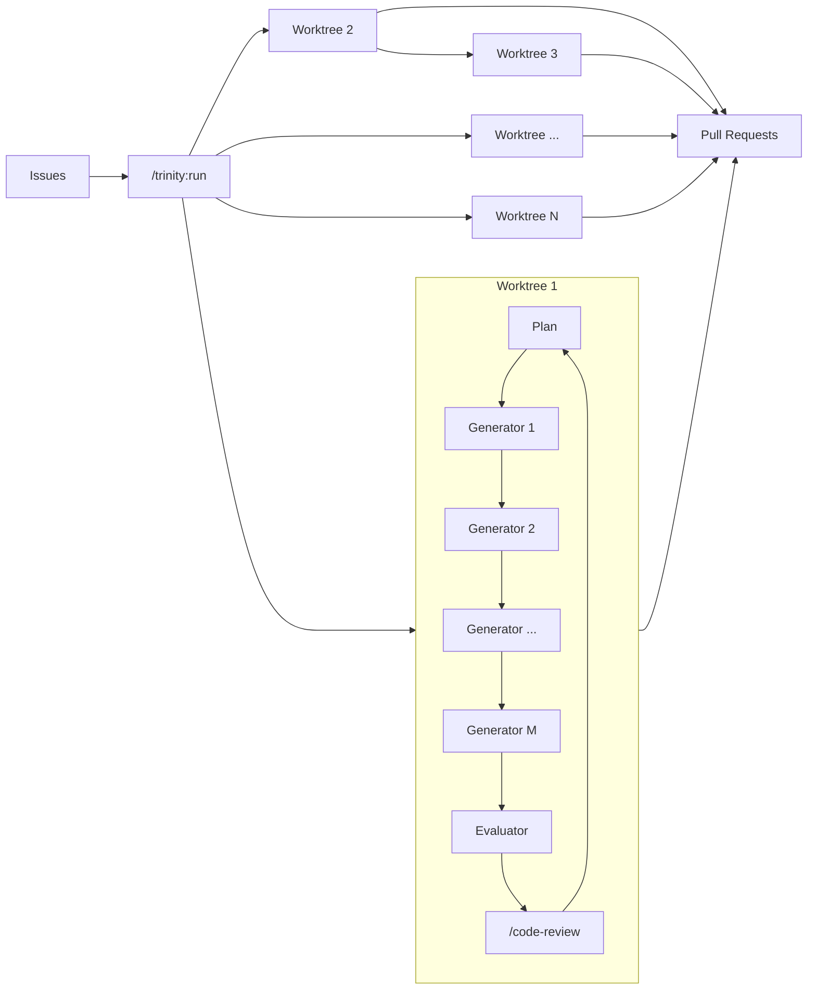

# Trinity

Trinity は、Anthropic の Planner / Generator / Evaluator パターンを Claude Code のサブエージェントで実装した、長時間タスク向けのハーネスである。 `/trinity:run <要件>` で起動すると、 `git-flow` スキルが切り出した隔離 worktree の中で Generator が実装してコミットし、Evaluator が Production-Ready の品質水準を承認するまで反復する。承認後はオーケストレーターが Pull Request を作成し、マージ候補の選択・課題起票・クリーンアップをユーザーに確認しながら進める。

## なぜ3エージェントに分けるのか

1つのエージェントで計画・実装・評価をまとめてやると、コンテキストが膨らむほどドリフトが起きる。実装の途中で計画が書き換わり、評価者が自分の作品を甘く見て、探索のトークンが実装のトークンを圧迫する。役割を3つのサブエージェントに分け、それぞれに固有のシステムプロンプトと新鮮なコンテキストを与えることで、各段の集中と評価者の独立した懐疑性を保つ。

Evaluator の独立性は、ファイルベースの通信によって構造的に強制される。Evaluator は `plan.md` と git diff だけを読み、Generator のチャットコンテキストや内部推論は読まない。差分は自分で再導出し、検証チェーンも自分で再実行する。これにより「自分の書いたコードに甘くなる」という単一エージェントの典型的な失敗モードが、設計上発生し得なくなる。

## 構成

オーケストレーターとサブエージェント3者で構成される。Orchestrator はメイン会話の Claude で、コードには触れず各段の起動と統合フローだけを担う。各アクターの役割を以下に示す。

| アクター | モデル | 役割 |
| :-- | :-- | :-- |
| Orchestrator | メイン会話 | 環境構築・各段の直列起動・PR 作成・確認・クリーンアップ |
| Planner | opus | 要件を受け入れ基準付きの `plan.md` に展開し、コミット単位のタスクに分割する |
| Generator | sonnet | 割り当てタスクを worktree 内で実装し、検証を通して1コミットする |
| Evaluator | sonnet | コミットを `plan.md` の基準で独立評価し、判定を書く |

agent 定義は `agents/` に、オーケストレーターの手順は `commands/run.md` に置く。ランの成果物（`plan.md`・`eval-*.md`・`gen-*.md`・`trinity.log` 等）は対象プロジェクトの `.trinity/<run>/` に出力される。worktree は `git-flow` スキルが `.trinity/` の外に切り出す。Pull Request・後片付けといった git 運用も同様に `git-flow` スキルに委譲する。

## Processing Units

Trinity が計画・実装を扱う処理単位を、粒度の大きい順に定義する。

| 用語 | 定義 |
| :-- | :-- |
| セッション | `/trinity:run` の起動から、PR 作成・改善提案（課題起票）・クリーンアップまでの、コマンド1回の実行全体。複数のパイプラインを束ねる最上位の単位 |
| パイプライン | 1つの Worktree で実行される処理系列。ループを Production-Ready な品質水準に達するまで繰り返し、1つの PR を作成するまでの流れ |
| ループ | パイプライン内で繰り返される `Plan → Generator → Evaluator → /code-review → Plan` の1周。Evaluator の3値判定と code-review の結果で継続と離脱を決める |
| タスク | 各 Generator が実施する1コミット単位の実行・動作。独立して動作し単独で検証可能な最小実装単位 |

## 処理フロー

Issues を受け取った Orchestrator は、Issue ごとに Worktree を用意し、直列・並列の両パターンでチームを編成する。各 Worktree の内部では Planner・Generator・Evaluator が連携し、Evaluator の3値判定でループの継続と離脱を決める。図は処理の全体像を抽象的に示す。



判定ごとの動作を以下に示す。

| 判定 | 動作 |
| :-- | :-- |
| `PASS` | code-review に must-fix（`/code-review` の出力に残った finding）が無ければループを離脱して PR 作成へ進む |
| `NEEDS_REVISION` | Planner が次周回で `plan.md` を上書きして再計画する |
| `FAIL` | Generator が既存計画の範囲内で修正する |

ループの離脱には Evaluator の `PASS` と code-review に must-fix（`/code-review` の出力に残った finding）が無いことの両方を要する。条件を満たすとオーケストレーターが push して PR を作成し、 `AskUserQuestion` で修正要否・課題起票・クリーンアップを順に確認する。

## 前提条件

Trinity を動かすには、以下のスキル／コマンドが必要である。

- [git-flow スキル](https://github.com/yjn279/.claude/tree/main/skills/git-flow) — worktree の作成・ブランチ管理・PR 統合を担うスキル。Orchestrator はこのスキルに git 運用を委譲する。
- [code-review コマンド](https://github.com/anthropics/claude-code/tree/main/plugins/code-review) — Orchestrator がループの別段として子プロセスで変更全体にコードレビューを実施するために使うコマンド。

未導入のものがある場合、Trinity は `/trinity:run` 起動時に自動で検出し、確認なしでセットアップを実施する（`~/.claude` への変更を含む）。

## 使い方

代表的な呼び出しを以下に示す。

```shell
/trinity:run ユーザー設定ページにテーマトグルを追加する。
/trinity:run 認証モジュールを JWT からセッション Cookie に移行する。
```

複数 Issue を同時に指定できる。互いに影響しない変更は Issue ごとに環境を整備して並列に処理し、それぞれ独立した PR を生む。影響する変更は依存する変更の実装後に後続を直列で実装する。いずれの場合も各 Issue は独立した PR として残し、PR 作成後にユーザーが選択したものだけをマージする。

```shell
/trinity:run #12 #15 #20
```

`/trinity:run` を起動した時点で、worktree 作成・ブランチ push・PR 作成までの許可を出したものとして扱う。PR 確定後は `AskUserQuestion` で修正要否・課題起票・クリーンアップを都度確認する。API 課金エラーやレートリミットで途中停止した場合は、作業環境が残っていれば再実行で続きから再開する。

## リリース運用

詳細は [`docs/release.md`](docs/release.md) を参照する。

## 参考資料

- Anthropic「Harness design for long-running apps」 https://www.anthropic.com/engineering/harness-design-long-running-apps
- Qiita「@nogataka 氏の解説記事」 https://qiita.com/nogataka/items/efe8eb9df612d2211221
