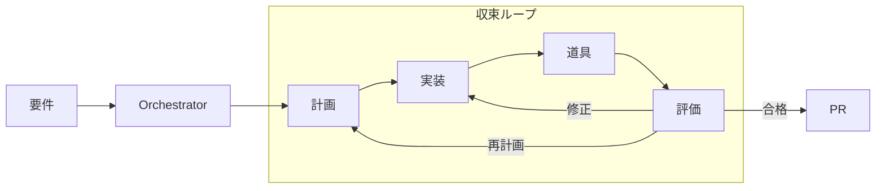

# Trinity

Trinity は、計画・実装・評価を分業する3つのエージェント（Planner・Generator・Evaluator）で、長時間のエンジニアリングタスクを走り切る Claude Code プラグインである。`/trinity:run <要件>` で起動すると、隔離された worktree の中で Generator が実装してコミットし、Evaluator が本番投入できる品質と認めるまで反復する。承認後は Orchestrator が PR を作成し、マージと後片付けまで進める。

ユーザーが関わるのは最初と最後だけである。起動直後に設計の分岐を確定し、最後に PR の受け入れを判断する。その間に確認は無く、長時間完全に自律で動く。導入すれば設定なしで使える。

## 役割

計画・実装・評価を1つの文脈に同居させると、文脈が膨らむほど計画が実装の都合で書き換わり、評価者が自分の作品に甘くなる。Trinity は役割を分け、それぞれに固有の指示と新鮮な文脈を与える。

| 役割 | モデル | 担当 |
| :-- | :-- | :-- |
| Orchestrator | メイン会話 | 要件の解釈・設計の確定・収束ループの起動と監視・PR 作成・受け入れ確認・後片付け |
| Planner | opus | 要件を、受け入れ基準付きの計画と機械可読なタスク一覧に展開する |
| Generator | sonnet | 割り当てられたタスクを worktree の中で実装し、検証を通してコミットする |
| Evaluator | sonnet | コミットを4軸で独立に評価し、3値の判定を返す |

Evaluator の独立性は、ファイル渡しの通信で構造的に強制される。各アクターは headless な `claude -p` の別プロセスとして起動され、互いのチャット文脈を見ない。Evaluator は計画と git の差分だけを読み、検証も自分で再実行する。「自分の書いたコードに甘くなる」という単一エージェントの典型的な失敗が、設計上起こらない。

## 評価

機械的に直せる指摘は、評価の前段で道具（`/code-review --fix`・`/simplify`）が自動で修正する。道具は差分につき一度だけ走り、Evaluator はその結果を証拠として読んだうえで、機械に委ねられない次の4軸だけを判断する。

| 軸 | 問い |
| :-- | :-- |
| 要件適合 | 受け入れ基準を実装が満たしているか |
| デザインの美 | UI・API・データモデルが素直で一貫しているか |
| コードの美 | 命名・構造・抽象が周囲に馴染み、読み手に易しいか |
| 要件妥当性 | そもそもの要件・計画が正しいか |

## 流れ

Orchestrator が作業単位ごとにブランチと worktree を切り出し、収束ループを1本ずつ直列に回す。ループの制御はシェル（`bin/trinity loop`）に機械化されており、Orchestrator は起動と監視だけを行う。


```mermaid
flowchart LR
  requirement[要件] --> orchestrator[Orchestrator]
  orchestrator --> plan
  subgraph loop[収束ループ]
    direction TB
    plan[計画] --> generate[実装]
    generate --> tools[道具]
    tools --> evaluate[評価]
    evaluate -->|再計画| plan
    evaluate -->|修正| generate
  end
  evaluate -->|合格| pullRequest[PR]
```

Evaluator の判定がループの継続と離脱を決める。離脱は `PASS` だけで決まる。

| 判定 | 動作 |
| :-- | :-- |
| `PASS` | 4軸すべてを満たす。ループを離脱して PR 作成へ進む |
| `NEEDS_REVISION` | 計画・要件が誤っている、または道具の変更が要件の記述と食い違う。Planner が要件の更新か挙動の回復かを自分で判断し、再計画する |
| `FAIL` | 計画は妥当。既存計画の範囲内で Generator が修正する |

## 仕様

確定している仕様を以下に示す。ここに無いものは実装の裁量である。

| 仕様 | 内容 |
| :-- | :-- |
| 処理フロー | 3アクター（Planner・Generator・Evaluator）と道具（`/code-review --fix`・`/simplify`）による検証で、1つの収束ループを回す |
| worktree 実行 | 作業は `git-flow` スキルで切り出した worktree の中で行う。複数の作業単位は直列に実行する |
| 確認 | 設計は起動時にフォアグラウンドの Orchestrator が `AskUserQuestion` で確定する。実行中はユーザーに確認しない |
| 子プロセス起動 | Planner・Generator・Evaluator は、作業のなかでさらにサブエージェントを呼べるよう、`claude -p` の子プロセスとして起動される |
| 柔軟性 | 複数 Issue・単発 Issue・Issue でないタスク・実施後の修正のいずれにも対応する |
| PR マージ | Git Issue が提示された場合は Issue ごとに独立した PR を作成し、`AskUserQuestion` で提示した候補のうちユーザーが選択したものをマージする |
| 課題起票 | 対象リポジトリと Trinity 本体それぞれの改善課題を `AskUserQuestion` で起票提案し、選択された課題を Issue として登録する |
| 再開 | 実行が中断（使用量上限・レートリミット・障害など）しても、到達済みの工程をやり直さず中断点から再開する |
| 後片付け | マージと課題起票の完了後、マージされた作業単位の環境（ブランチ・worktree・ラン成果物）をリモートを含めて削除する。マージされなかった単位はすべて残す |

## 前提

`bash`・`git`・`claude` CLI が PATH にあり、次のスキルとコマンドが導入されていること。未導入のものは `/trinity:run` の起動時に自動で検出し、確認なしでセットアップされる（`~/.claude` への変更を含む）。

- [git-flow スキル](https://github.com/yjn279/.claude/tree/main/skills/git-flow) — worktree の作成・ブランチ管理・PR 統合を担う。
- [code-review コマンド](https://github.com/anthropics/claude-code/tree/main/plugins/code-review) — `/code-review --fix` として差分のバグと整理を自動修正する。
- `/simplify` — 整理を適用する Claude Code の組み込みコマンド。

## 使い方

要件は自由形式の文でも Issue 番号でもよい。

```shell
/trinity:run ユーザー設定ページにテーマトグルを追加する。
/trinity:run 認証モジュールを JWT からセッション Cookie に移行する。
/trinity:run #12 #15 #20
```

複数 Issue を渡すと、Issue ごとに独立したブランチ・worktree・PR を作り、1本ずつ直列に処理する。途中で停止した場合は、同じセッションの作業環境が残っていれば再度起動するだけで中断点から再開する。

## 参考

- Anthropic「Harness design for long-running apps」 https://www.anthropic.com/engineering/harness-design-long-running-apps
- Qiita「@nogataka 氏の解説記事」 https://qiita.com/nogataka/items/efe8eb9df612d2211221
