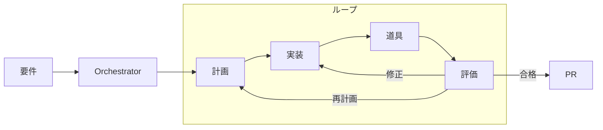

# Trinity

Trinity は、要件を渡すと計画・実装・評価を繰り返して Pull Request に仕上げる、長時間タスク向けの Claude Code プラグインである。導入するだけで設定なしに使える。あなたがすることは2つだけで、最初に設計の確認へ答えることと、最後にどの PR を受け入れるかを選ぶことである。その間は人手なしで走り切る。

## 導入

Claude Code で次を実行する。

```shell
/plugin marketplace add yjn279/trinity
/plugin install trinity@yjn279
```

`bash`・`git`・`claude` CLI が PATH にあること。依存する [git-flow スキル](https://github.com/yjn279/.claude/tree/main/skills/git-flow)・[code-review コマンド](https://github.com/anthropics/claude-code/tree/main/plugins/code-review)・`/simplify` は、未導入でも起動時に自動でセットアップされる（`~/.claude` への変更を含む）。

## 使い方

要件は自由形式の文でも Issue 番号でもよい。

```shell
/trinity:run ユーザー設定ページにテーマトグルを追加する。
/trinity:run #12 #15 #20
```

起動すると、作業単位ごとにブランチと作業用の複製フォルダ（worktree）を切り、1本ずつ直列に処理して独立した PR を作る。使用量上限や障害で途中停止しても、再度起動すれば完了済みの工程を飛ばして続きから再開する。仕上がった PR はマージ候補として提示され、マージされた作業単位の環境は自動で片付く。選ばなかった PR は環境ごと残るほか、修正要望を添えてその場で作り直させることもできる。

## 仕組み

計画・実装・評価を1つの文脈に同居させると、文脈が膨らむほど計画が実装の都合で書き換わり、評価者が自分の作品に甘くなる。Trinity は役割を分け、Orchestrator（`/trinity:run` を受け取ったメイン会話の Claude 自身）が残り3つの役割を、固有の指示と新鮮な文脈を持つ `claude -p` の別プロセスとして起動する。受け渡しはファイルだけで行い、Evaluator は差分も検証も自分で再導出するため、「自分の書いたコードに甘くなる」という単一エージェントの典型的な失敗が設計上起こらない。

| 役割 | モデル | 担当 |
| :-- | :-- | :-- |
| Orchestrator | メイン会話 | 要件の解釈・設計の確定・ループの起動と監視・PR 作成・受け入れ確認・後片付け |
| Planner | opus | 要件を、受け入れ基準付きの計画とタスク一覧に展開する |
| Generator | sonnet | 割り当てられたタスクを worktree の中で実装し、検証を通してコミットする |
| Evaluator | sonnet | コミットを4軸（要件適合・デザインの美・コードの美・要件妥当性）で独立に評価し、判定を返す |

## 流れ

作業単位ごとにループ（`scripts/loop.sh`）を回す。機械的に直せる指摘は道具（`/code-review --fix`・`/simplify`）が差分につき一度だけ自動修正し、Evaluator は機械に委ねられない4軸の判断に集中する。


```mermaid
flowchart LR
  requirement[要件] --> orchestrator[Orchestrator]
  orchestrator --> plan
  subgraph loop[ループ]
    direction TB
    plan[計画] --> generate[実装]
    generate --> tools[道具]
    tools --> evaluate[評価]
    evaluate -->|再計画| plan
    evaluate -->|修正| generate
  end
  evaluate -->|合格| pullRequest[PR]
```

Evaluator の判定がループの継続と離脱を決める。

| 判定 | 動作 |
| :-- | :-- |
| `PASS` | 4軸すべてを満たす。ループを離脱して PR 作成へ進む |
| `NEEDS_REVISION` | 計画・要件が誤っている、または道具の変更が要件の記述と食い違う。Planner が要件の更新か挙動の回復かを自分で判断し、再計画する |
| `FAIL` | 計画は妥当。既存計画の範囲内で Generator が修正する |

## 仕様

確定している仕様を以下に示す。ここに無いものは実装の裁量である。

| 仕様 | 内容 |
| :-- | :-- |
| 処理フロー | 3つの役割（Planner・Generator・Evaluator）と道具（`/code-review --fix`・`/simplify`）による検証で、1つのループを回す |
| worktree 実行 | 作業は `git-flow` スキルで切り出した worktree の中で行う。複数の作業単位は直列に実行する |
| 確認 | 設計は起動時にメイン会話の Orchestrator が `AskUserQuestion` で確定する。実行中はユーザーに確認しない |
| 子プロセス起動 | Planner・Generator・Evaluator は、作業のなかでさらにサブエージェントを呼べるよう、`claude -p` の子プロセスとして起動される |
| 柔軟性 | 複数 Issue・単発 Issue・Issue でないタスク・実施後の修正のいずれにも対応する |
| PR マージ | Git Issue が提示された場合は Issue ごとに独立した PR を作成し、`AskUserQuestion` で提示した候補のうちユーザーが選択したものをマージする |
| 課題起票 | 対象リポジトリと Trinity 本体それぞれの改善課題を `AskUserQuestion` で起票提案し、選択された課題を Issue として登録する |
| 再開 | 実行が中断（使用量上限・レートリミット・障害など）しても、到達済みの工程をやり直さず中断点から再開する |
| 後片付け | マージと課題起票の完了後、マージされた作業単位の環境（ブランチ・worktree・実行時に生成されたファイル）をリモートを含めて削除する。マージされなかった単位はすべて残す |

## 開発

規約とファイル構成は [CLAUDE.md](CLAUDE.md) を参照する。

## 参考

- Anthropic「Harness design for long-running apps」 https://www.anthropic.com/engineering/harness-design-long-running-apps
- Qiita「@nogataka 氏の解説記事」 https://qiita.com/nogataka/items/efe8eb9df612d2211221
