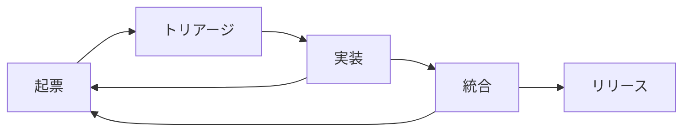

# 開発標準プロセス

Issue の起票からリリースまでの開発標準プロセスを定義する文書である。各ステージは人手でも実行できるが、 `/loop /trinity:auto` を起動すると全ステージが無人で駆動する（サイクルの実行手順は [`commands/auto.md`](../commands/auto.md) ）。採否・優先度・設計の判断はすべて [`docs/product.md`](product.md) を単一の正として照合する。

## Overview

プロセスは5つのステージの循環で構成される。実装と統合の過程で見つかった改善課題は起票へ還流し、バックログが自律的に補充される。



各ステージの責務と完了条件を以下に示す。

| ステージ | 責務 | 完了条件 |
| :-- | :-- | :-- |
| 起票 | 課題を受け入れ基準付きの Issue として登録する | 目的と受け入れ基準を備えた Issue |
| トリアージ | 軸と照合して採否と優先度を決める | `status` ・ `priority` ラベルの付与 |
| 実装 | `/trinity:run` のパイプラインで実装する | Evaluator `PASS` かつ must-fix なしの PR |
| 統合 | マージ条件を確認して main へ統合する | squash merge と環境クリーンアップ |
| リリース | リリース PR を確認してリリースする | タグ `vX.Y.Z` と GitHub Release |

## Filing

Issue は `.github/ISSUE_TEMPLATE/` の Issue Forms（機能要望・バグ報告）で起票する。どちらの形式でも、目的（なぜやるか）と受け入れ基準（何をもって完了とするか）を必須とする。受け入れ基準は Planner が `plan.md` に展開する起点であり、PASS/FAIL で検証可能な粒度で書く。

自律運転による自動起票は、次の3条件をすべて満たす場合に限る。

- 出典がある: パイプラインの成果物（Evaluator の持ち越し指摘・code-review の残指摘・改善提案）または `docs/product.md` のロードマップに由来し、出典を本文に明記する。
- 軸に合致する: `docs/product.md` の Principles を1つ以上強化し、Scope の「やらないこと」に踏み込まない。
- 上限内である: 1サイクルあたり2件まで。

## Triage

`status` ラベルの無い open Issue をトリアージ対象とする。 `docs/product.md` と照合し、次の2値に振り分ける。

| 振り分け | 条件 | 操作 |
| :-- | :-- | :-- |
| `status: ready` | 軸に合致し、着手可能である | `priority` ラベルを併せて付与する |
| `status: blocked` | 軸に反する・軸で判断できない・受け入れ基準が定まらない | 理由をコメントに残し、人間の判断を待つ |

優先度は復旧を最優先とし、次いで軸への貢献度で決める。

| 優先度 | 基準 |
| :-- | :-- |
| `priority: high` | 壊れているもの（bug）、および自律運転を止める・誤らせる課題 |
| `priority: medium` | 軸（Principles・Roadmap）を直接強化する機能・改善 |
| `priority: low` | 上記以外の改善・整理・ドキュメント |

## Implementation

`status: ready` の Issue を優先度順に `/trinity:run #N` で実装する。1 Issue は1ブランチ・1 worktree・1 PR に対応させ、着手時に `status: in-progress` ラベルへ付け替える。パイプライン内部の規約（ループ・3値判定・code-review）は `commands/run.md` と `agents/` の定義に従う。

## Integration

PR のマージ条件を以下に示す。すべて満たした PR を squash merge し、マージ後はブランチ・worktree を削除して対応 Issue をクローズする。

- Trinity のパイプラインが完了条件（Evaluator `PASS` かつ must-fix なし）を満たして作成した PR である。人手の PR は自動統合の対象外とし、サイクル報告にのみ載せる。
- main とのコンフリクトが無い。コンフリクトがある場合は該当 Issue のパイプラインを再開し、Generator に解消を委譲する。
- PR タイトルが Conventional Commits 形式である（release-please のバージョン算出に必須）。
- 必須チェックが定義されていればすべて green である。本リポジトリの実体はプロンプトのため CI チェックは無く、検証は Evaluator と code-review が担う。

## Release

リリースは release-please に委譲する（詳細は [`docs/release.md`](release.md) ）。main への push がリリース PR を生成・更新し、リリース PR のマージがそのままリリースとなる。マージ前の確認観点は、CHANGELOG が意図した変更を正しく収録していること、バージョン増分が変更内容に対して妥当であることの2点である。

## Automation

`/loop /trinity:auto` を起動すると、上記の全ステージが1サイクルずつ無人で駆動する。暴走と滞留を防ぐガードレールの規定値を以下に示す。

| ガードレール | 規定値 |
| :-- | :-- |
| WIP 上限 | 自律運転が扱う open PR はリリース PR を除いて3件まで。超過中は新規着手しない |
| 新規着手 | 1サイクルにつき1 Issue まで |
| 自動起票 | 1サイクルにつき2件まで。出典と軸照合を必須とする |
| 失敗の隔離 | 同一 Issue でパイプラインが2サイクル連続で完走しなければ `status: blocked` に送り、以後の自動対象から外す |
| 進捗ゼロ | 3サイクル連続で成果（リリース・マージ・着手・起票のいずれか）が無ければ、要因を報告して人間の介入と `/loop` 停止を提案する |
| 軸の専権 | `docs/product.md` の変更は行わない。変更が必要だと判断したら提案 Issue の起票に留める |

自律運転後も人間に残るチェックポイントは、 `status: blocked` の解消、 `docs/product.md` の更新、GitHub Release の事後監督の3点である。

## Setup

自律運転に必要なワンタイムのリポジトリ設定を以下に示す（本リポジトリでは設定済み）。

1. release-please の設定（ `docs/release.md` の「ワンタイムのリポジトリ設定」を参照する）。
2. トリアージ用ラベルの作成。

    ```bash
    gh label create "status: ready" --color 0E8A16 --description "トリアージ済み。自律運転が着手できる"
    gh label create "status: in-progress" --color FBCA04 --description "パイプラインが実装中"
    gh label create "status: blocked" --color B60205 --description "人間の判断待ち。自律運転の対象外"
    gh label create "priority: high" --color D93F0B --description "壊れているもの・自律運転を止める課題"
    gh label create "priority: medium" --color FFA500 --description "軸を直接強化する機能・改善"
    gh label create "priority: low" --color C2E0C6 --description "その他の改善・整理・ドキュメント"
    ```
