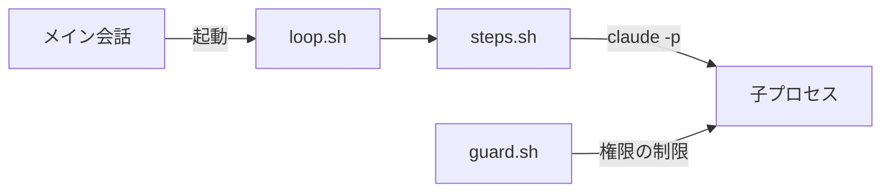
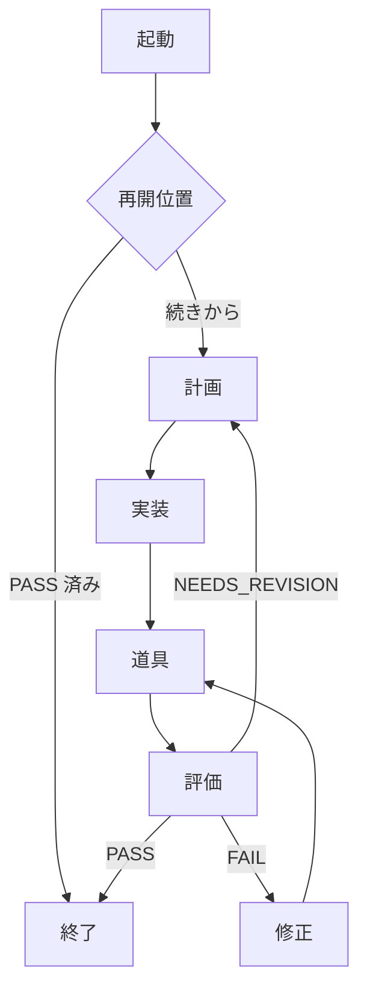
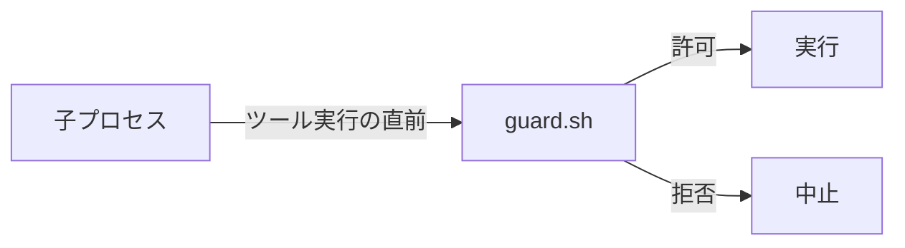

# スクリプト

このフォルダには、Trinity を動かすシェルスクリプトが入っている。ユーザーが直接実行するものではなく、`/trinity:run` を受け取ったメイン会話の Claude（Orchestrator）が `commands/run.md` の手順に従って起動する。

作業単位1つにつき `loop.sh` が1本、バックグラウンドで走る。`loop.sh` は各段の関数（`steps.sh`）を順に呼び、それぞれの段が Planner・Generator・Evaluator を `claude -p` の子プロセスとして起動する。子プロセスには `guard.sh` が組み込まれ、ツールを使う直前に毎回呼ばれて役割ごとの権限を制限する。

## loop.sh

1つの作業単位の収束ループを回す。評価が PASS を返すまで最大 `TRINITY_MAX_LOOPS` 回（既定 `5`）繰り返し、修正（`FAIL` の後）でも道具と評価は毎回通る。

進み具合は `RUN_DIR/status` に1語で記録する。`passed`・`failed`・`error` が終了状態で、実行中は `running` のままになる。あわせて `RUN_DIR/pid` に自分のプロセス番号を書いて二重起動を防ぎ、終了時に消す。

再開は「どの段も、出力ファイルが既に在れば飛ばす」という1つの決まりで実現している。途中で止まっても、もう一度起動するだけで完了済みの段を飛ばして続きから走る。再開位置は `eval-<n>.md` の最大番号とその判定から決める。

| 最後の判定 | 次の動き |
| :-- | :-- |
| 無し | ループ 1 を計画から始める |
| `PASS` | 何もせず `passed` で終わる（`redrive` があるときは例外。次項） |
| `NEEDS_REVISION` | 次のループを計画から始める |
| `FAIL` | 次のループを修正から始める |

`RUN_DIR/redrive` は、受け入れ確認で修正要望が入ったときに Orchestrator が作る空ファイルである（本文は `requirement.md` に追記される）。これが在ると PASS 済みでも作り直しを始め、新しい `passed` か `failed` に達したときに消える。

`RUN_DIR` に残る主なファイルを以下に示す。

| ファイル | 書く人 | 内容 |
| :-- | :-- | :-- |
| `requirement.md` | Orchestrator | 要件と確定した設計。修正要望もここに追記される |
| `plan.md`・`plan-<n>.md` | Planner | 計画。`plan-<n>.md` はループごとの再開用の控え |
| `tasks.tsv` | Planner | タスク一覧（タブ区切りで1行1タスク） |
| `gen-<n>-task-<i>.md`・`gen-<n>-revise.md` | Generator | タスクと修正の完了レポート |
| `review.md`・`simplify.md` | 道具 | レビューと整理の結果 |
| `eval-<n>.md` | Evaluator | ループごとの判定（先頭行が `VERDICT:`） |
| `status`・`pid`・`redrive` | `loop.sh`・Orchestrator | 状態・実行中の目印・作り直しの合図 |
| `trinity.log` | 全員 | 実行ログ |

## steps.sh

`loop.sh` が読み込む関数の集まりで、各段の実体である。

| 関数 | 段 | すること |
| :-- | :-- | :-- |
| `plan` | 計画 | Planner を起動し、`plan.md` と `tasks.tsv` を作らせる |
| `generate` | 実装 | `tasks.tsv` の1行ごとに Generator を起動する。コミットか完了レポートが無ければ失敗として止める |
| `revise` | 修正 | `FAIL` の指摘を、計画の範囲内で Generator に直させる |
| `tools` | 道具 | `/code-review --fix` と `/simplify` を同じ差分に一度だけ走らせ、直した分をコミットする |
| `evaluate` | 評価 | Evaluator を起動し、判定が読めたときだけ `eval-<n>.md` を確定する |

子プロセスの起動は `actor` 関数に集約している。役割名を環境変数 `TRINITY_ROLE` で渡し、モデルは `agents/<役割>.md` の frontmatter から読み、`guard.sh` をフックとして注入する。

## guard.sh

子プロセスがツール（Write・Edit・Bash など）を使う直前に毎回呼ばれ、役割ごとの権限で許可・拒否を決めるフックである。約束をプロンプトで頼むのではなく、仕組みとして強制する。

| 役割 | 書き込み | git |
| :-- | :-- | :-- |
| Planner | `RUN_DIR` の中だけ | 読み取りだけ |
| Generator | 制限なし | 読み取りと worktree 内の変更。push・`--amend`・`--no-verify` は拒否 |
| Evaluator | 全面拒否 | 読み取りだけ |

git は許可一覧に載るサブコマンドだけを許し、一覧に無いものはすべて拒否する。役割によらず、設定の変更（`config`・`-c`。別名の定義やコマンド実行を仕込めるため）と、git を含む複合コマンド（`&&` や `|` でつないだもの。git の部分を安全に切り出せないため）も拒否し、1コマンドずつに分けて実行させる。

## テスト

どちらも素の `bash` だけで動く。

- `bash scripts/test-guard.sh` — 権限の許可・拒否を 27 ケースで確かめる。
- `bash scripts/test-loop.sh` — 偽の `claude` コマンドを使い、`loop.sh` を通しで動かして成果物・終了状態・再開・作り直しを確かめる。
